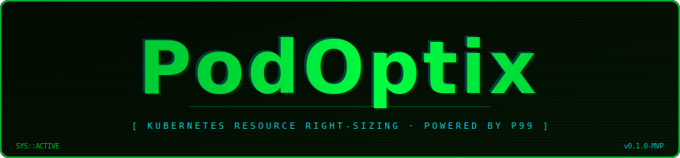

<div align="center">



<br/>
<br/>
<br/>

[](LICENSE)
[](https://golang.org)
[](https://kubernetes.io)
[](https://prometheus.io)
[](https://www.postgresql.org)
[](https://redis.io)
[](https://jwt.io)

</div>

---

## The Problem

**3:12 AM. PagerDuty fires. `payment-api` is OOMKilled in production.**

The root cause? Someone copied resource limits from an unrelated service six months ago. The fix takes 2 minutes. Finding it took 40. It will happen again.

This is what happens when 150 containers across 50 microservices all have limits set by guesswork:

| Symptom | Reality |
|---------|---------|
| Pods OOMKilled at midnight | Limits set too low with no data |
| Cloud bill up 40-60% | Limits set too high — paying for unused capacity |
| Engineers afraid to reduce limits | Nobody knows actual usage |
| Cascading failures | Limits copied from unrelated workloads |
| Finance blind to cost drivers | No per-service visibility across clusters |

**Every new microservice makes it worse. The problem compounds.**

---

## The Solution

PodOptix connects to your Prometheus, analyzes **real usage patterns**, and recommends limits at **2× the p99 percentile** — the engineering sweet spot between reliability and cost.

```
Actual Usage (p99)  →  × 2  →  Recommended Limit
      120m CPU                      240m CPU
      180Mi RAM                     360Mi RAM
```

No more guessing. No more waste.

---

## Architecture

PodOptix runs as a single **Master Hub** — deployed once in your management or ops cluster. No agents. No sidecars. Nothing to deploy inside your workload clusters.

From there, the Hub connects directly to each cluster's Prometheus HTTP API, runs PromQL queries to fetch real usage data, computes p99 percentiles, and generates recommendations — all from one place.

```
┌─────────────────────────────────────────────────────────────┐
│                         HUB                                 │
│       Master Control Plane · Dashboard · REST API           │
│        Queries p99 · Generates Recommendations              │
└──────────┬──────────────────┬──────────────────┬────────────┘
           │                  │                  │
      (PromQL API)       (PromQL API)       (PromQL API)
           │                  │                  │
    ┌──────┴──────┐    ┌──────┴──────┐    ┌──────┴──────┐
    │ Prometheus  │    │ Prometheus  │    │ Prometheus  │
    │  Cluster 1  │    │  Cluster 2  │    │  Cluster 3  │
    └─────────────┘    └─────────────┘    └─────────────┘
```

| Component | Role |
|-----------|------|
| **Hub** | Connects to each cluster's Prometheus · Runs PromQL queries · Computes p99 · Generates recommendations · Serves the dashboard |

**Onboarding a cluster takes 30 seconds** — just register the Prometheus endpoint and an auth token. That's it.

> For a deep dive into Hub internals, data flow, component reference, metrics collected, and the security model — see [docs/architecture.md](docs/architecture.md).

---

## Quick Start

```bash
# Deploy PodOptix Hub in your management / ops cluster
helm repo add podoptix https://charts.podoptix.io
helm repo update

helm install podoptix podoptix/hub \
  --namespace podoptix \
  --create-namespace \
  --set db.url=<postgresql-url> \
  --set redis.url=<redis-url>
```

That's it. Register your workload clusters via the dashboard and recommendations start appearing within 24 hours.

---

## Roadmap

- [x] Architecture design
- [x] Technology decisions and trade-offs
- [x] Project structure and scaffold
- [x] Data models (Cluster, Recommendation)
- [x] Config loader (environment variables)
- [x] Database schema sync (PostgreSQL)
- [x] Database store layer with connection pool
- [x] HTTP server (Gin)
- [x] REST API endpoints
- [x] Automated integration tests
- [x] Auth (JWT)
- [x] Prometheus metrics collector (Hub → PromQL API)
- [x] p99 computation engine
- [x] Recommendation engine
- [x] Scheduler (cron-based collection jobs)
- [x] Cache layer (Redis)
- [x] Token encryption at rest (AES-256)
- [x] Central Hub with multi-cluster support
- [x] Web Dashboard
- [x] Docker image
- [x] Helm chart

---

## Contributing

PodOptix is in early development. PRs, issues, and ideas are welcome.

---

<div align="center">
<b>For every platform engineer who got paged at midnight because someone set a memory limit by guesswork.</b>
</div>
