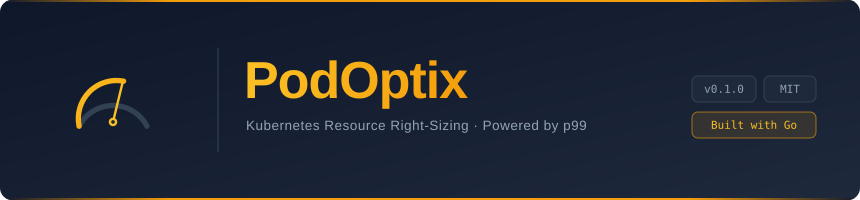

<div align="center">



<br/>
<br/>

[](LICENSE)
[](https://golang.org)
[](https://kubernetes.io)
[](https://prometheus.io)
[](https://www.postgresql.org)
[](https://redis.io)
[](https://jwt.io)

</div>

---

## The Problem

**3:12 AM. PagerDuty fires. The on-call engineer gets paged. `payment-api` is OOMKilled in production.**

The root cause? Someone copied resource limits from an unrelated service six months ago. The fix takes 2 minutes. Finding it took 40. It will happen again.

This is what happens when 150 containers across 50 microservices all have limits set by guesswork:

| Symptom | Reality |
|---------|---------|
| Pods OOMKilled at midnight | Limits set too low with no data |
| Cloud bill up 40-60% | Limits set too high — paying for unused capacity |
| Engineers afraid to reduce limits | Nobody knows actual usage |
| Cascading failures | Limits copied from unrelated workloads |
| Finance blind to cost drivers | No per-service visibility across clusters |

**Every new microservice makes it worse. The problem compounds.**

---

## The Solution

PodOptix connects to your Prometheus, analyzes **real usage patterns**, and recommends limits at **2× the p99 percentile** — the engineering sweet spot between reliability and cost.

```
Actual Usage (p99)  →  × 2  →  Recommended Limit
      120m CPU                      240m CPU
      180Mi RAM                     360Mi RAM
```

No more guessing. No more waste.

---

## Architecture

PodOptix runs as a single **Master Hub** deployed in your management or ops Kubernetes cluster. No agents. No sidecars. Nothing to deploy inside your workload clusters.

The Hub connects directly to each cluster's Prometheus HTTP API, queries p99 metrics, and generates recommendations — all from one place.

```
┌─────────────────────────────────────────────────────────────┐
│                         HUB                                 │
│       Master Control Plane · Dashboard · REST API           │
│        Queries p99 · Generates Recommendations              │
└──────────┬──────────────────┬──────────────────┬────────────┘
           │ PromQL API       │ PromQL API       │ PromQL API
    ┌──────┴──────┐    ┌──────┴──────┐    ┌──────┴──────┐
    │ Prometheus  │    │ Prometheus  │    │ Prometheus  │
    │  Cluster 1  │    │  Cluster 2  │    │  Cluster 3  │
    └─────────────┘    └─────────────┘    └─────────────┘
```

Register a cluster with its Prometheus URL + auth token. Recommendations are generated on startup and refreshed every 24 hours.

---

## Web Dashboard

PodOptix ships with a first-class web UI — React 18 + TypeScript + Vite + Tailwind, styled to match Grafana's dark theme.

Pages: Login · Register · Clusters list · Register Cluster · Edit Cluster · Cluster Detail (recommendations table + one-click recalculate).

Lives in [`web/`](web/). Local development: `cd web && npm run dev` (Vite on `:5173` proxying to the backend on `:8080`).

**Production ships as a single binary.** `make build` compiles the React dashboard, embeds `web/dist/` into the Go binary via `//go:embed`, and outputs `bin/podoptix` — one artifact serving the API and dashboard on the same origin. No separate frontend server. No CORS. See [web/DASHBOARD.md](web/DASHBOARD.md) for the full guide.

---

## Quick Start

**Prerequisites:** Go 1.26+, Node.js 20+, Docker. Full setup in [docs/dev-setup.md](docs/dev-setup.md).

```bash
git clone https://github.com/RISHABH1270/PodOptix.git && cd PodOptix
cp .env.example .env
docker compose up -d           # PostgreSQL + Redis + local Prometheus
```

Then pick one:

### Option A — Development (hot reload)

```bash
# Terminal 1 — backend on :8080
export $(cat .env | xargs) && go run ./cmd/hub

# Terminal 2 — dashboard on :5173 (Vite dev server)
cd web && npm install && npm run dev
```

Open <http://localhost:5173>. Edit any `.tsx` → instant reload.

### Option B — Single binary (production-style)

```bash
make build                                     # builds dashboard + Go binary → bin/podoptix
export $(cat .env | xargs) && ./bin/podoptix   # one process, one port
```

Open <http://localhost:8080>. Dashboard and API on the same origin — same as production.

### Option C — Docker container

```bash
make docker-build                              # builds podoptix:local (44 MB distroless image)
make docker-run                                # runs against docker compose Postgres/Redis
```

Multi-arch push (linux/amd64 + linux/arm64) once you have a registry:
```bash
make docker-push IMAGE=ghcr.io/<your-user>/podoptix TAG=v0.1.0
```

> Helm chart coming next (see roadmap).

---

## API

| Method | Endpoint | Auth | Description |
|--------|----------|------|-------------|
| `POST` | `/auth/register` | — | Create a user account |
| `POST` | `/auth/login` | — | Login and receive JWT token |
| `GET` | `/healthz` | — | Liveness probe |
| `GET` | `/readyz` | — | Readiness probe (checks DB + Redis) |
| `GET` | `/api/v1/clusters` | JWT | List all clusters |
| `POST` | `/api/v1/clusters` | JWT | Register a cluster |
| `GET` | `/api/v1/clusters/:id` | JWT | Get cluster by ID |
| `PUT` | `/api/v1/clusters/:id` | JWT | Update cluster details |
| `DELETE` | `/api/v1/clusters/:id` | JWT | Remove a cluster |
| `GET` | `/api/v1/clusters/:id/recommendations` | JWT | Get recommendations (cached) |
| `POST` | `/api/v1/clusters/:id/recalculate` | JWT | Trigger manual recalculation |

---

## Documentation

| Doc | Description |
|-----|-------------|
| [HLD](docs/hld.md) | High Level Design — system overview, architecture, data flow |
| [LLD](docs/lld.md) | Low Level Design — DB schema, API contract, Redis design, security model |
| [Engineering Trade-offs](docs/engineering-trade-offs.md) | Every technical decision with full reasoning |
| [Dev Setup](docs/dev-setup.md) | How to run locally in 5 minutes |
| [API Testing Guide](tests/TESTING.md) | Backend Go test suite — structure, isolation, helpers |
| [Dashboard Guide](web/DASHBOARD.md) | React dashboard — dev server, structure, build |
| [UI Testing Guide](web/tests-e2e/UI_TESTING.md) | Playwright end-to-end tests — isolation, commands, debugging |

---

## Roadmap

- [x] Architecture design and documentation
- [x] Data models (Cluster, Recommendation, User)
- [x] Config loader (environment variables)
- [x] PostgreSQL — migrations, store layer, connection pool
- [x] HTTP server (Gin) with middleware (RequestID + JWT)
- [x] REST API — full CRUD for clusters + recommendations
- [x] Auth — JWT + bcrypt password hashing
- [x] Token encryption at rest (AES-256-GCM)
- [x] Prometheus metrics collector (PromQL API)
- [x] p99 computation engine
- [x] Recommendation engine
- [x] Scheduler — 24h ticker + immediate on startup
- [x] Redis — recommendations cache + distributed lock
- [x] Backend integration tests — 63 tests, real TCP server + PostgreSQL + Redis, isolated DB/port
- [x] Readiness probe (/readyz)
- [x] Graceful shutdown (SIGTERM/SIGINT)
- [x] Structured logging (INFO/WARN/ERROR + request_id + duration)
- [x] Interactive architecture docs ([docs/architecture.html](docs/architecture.html))
- [x] Web Dashboard — React 18 + TypeScript + Vite + Tailwind (Grafana-dark theme)
- [x] UI end-to-end tests — Playwright + Chromium, 9 tests
- [x] Embed dashboard into Go binary via `go:embed` — single-binary build via `make build`
- [x] Multi-arch Docker image (linux/amd64 + linux/arm64) — 44 MB distroless, `make docker-build` / `make docker-push`
- [ ] Helm chart
- [ ] CI/CD (GitHub Actions)
- [ ] User password change endpoint
- [ ] Cross-cluster recommendations view
- [ ] Cost savings dashboard

---

## Contributing

PodOptix is in active development. PRs, issues, and ideas are welcome.

---

<div align="center">
<b>For every platform engineer who got paged at midnight because someone set a memory limit by guesswork.</b>
</div>
