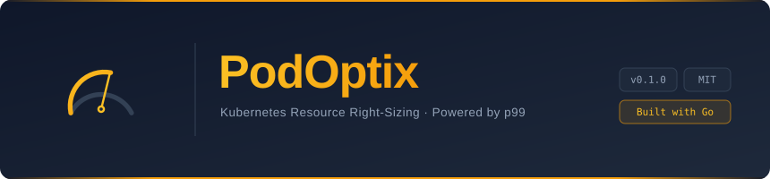

<div align="center">



<br/>
<br/>

[](LICENSE)
[](https://golang.org)
[](https://kubernetes.io)
[](https://prometheus.io)
[](https://www.postgresql.org)
[](https://redis.io)
[](https://jwt.io)

</div>

---

## The Problem

> [!CAUTION]
> **3:12 AM.** PagerDuty fires. The on-call engineer gets paged.
> **`payment-api` is OOMKilled in production.**

The root cause? Someone copied resource limits from an unrelated service six months ago. The fix takes 2 minutes. Finding it took 40 minutes. It will happen again.

This is what happens when 150 containers across 50 microservices all have limits set by guesswork in production:

| Symptom | Reality |
|---------|---------|
| Pods OOMKilled at midnight | Memory **limits** set too low with no data |
| Cloud bill up 40-60% | **Requests** set too high — nodes reserve capacity nobody uses |
| Engineers afraid to reduce limits | Nobody knows actual usage |
| Cascading failures | Requests and limits copied from unrelated workloads |
| Finance blind to cost drivers | No per-service visibility across clusters |

**Every new microservice makes it worse. The problem compounds.**

---

## The Solution

PodOptix connects to your Prometheus, computes **p99** from real usage, and recommends both `requests` and `limits` — the engineering sweet spot between reliability and cost.

**The formula** (same for CPU and memory):

```
request = ceil(p99)         ← scheduler reserves this · pod is guaranteed this much
limit   = ceil(p99 × 2)     ← hard ceiling · CPU gets throttled, pod gets OOMKilled on memory overrun
```

**Example** — a container averaging 120m CPU and 180Mi RAM at the 99th percentile:

| Resource | p99 (actual usage) | Recommended request | Recommended limit |
|----------|-------------------:|--------------------:|------------------:|
| **CPU** | 120m | **120m** | **240m** |
| **Memory** | 180Mi | **180Mi** | **360Mi** |

No more guessing. No more waste.

---

## Architecture

PodOptix runs as a single **Master Hub** deployed in your management or ops Kubernetes cluster. No agents. No sidecars. Nothing to deploy inside your workload clusters.

The Hub connects directly to each cluster's Prometheus HTTP API, queries p99 metrics, and generates recommendations — all from one place.

```
┌─────────────────────────────────────────────────────────────┐
│                         HUB                                 │
│       Master Control Plane · Dashboard · REST API           │
│        Queries p99 · Generates Recommendations              │
└──────────┬──────────────────┬──────────────────┬────────────┘
           │ PromQL API       │ PromQL API       │ PromQL API
    ┌──────┴──────┐    ┌──────┴──────┐    ┌──────┴──────┐
    │ Prometheus  │    │ Prometheus  │    │ Prometheus  │
    │  Cluster 1  │    │  Cluster 2  │    │  Cluster 3  │
    └─────────────┘    └─────────────┘    └─────────────┘
```

Register a cluster with its Prometheus URL + auth token. The first sync fires immediately on registration; subsequent syncs run on a 24-hour interval (or on-demand via the **Recalculate** button).

---

## Web Dashboard

PodOptix ships with a first-class web UI — React 18 + TypeScript + Vite + Tailwind.

**Pages:**
- **Login / Register** — email + password, JWT in localStorage
- **Clusters** — list all registered clusters with status pills + stat cards
- **Register Cluster / Edit Cluster** — form with lookback picker (7d | 10d | 30d)
- **Cluster Detail** — per-container recommendations table + one-click recalculate
- **Recommendations** — every recommendation across every cluster, with applied vs pending status, sortable by cluster, namespace, or biggest potential saving
- **Savings** — CPU and memory already **reclaimed** (applied) + still **on the table** (pending), adoption %, top opportunities, per-cluster + per-namespace breakdown

Lives in [`web/`](web/). Local development: `cd web && npm run dev` (Vite on `:5173` proxying to the backend on `:8080`).

**Production ships as a single binary.** `make build` compiles the React dashboard, embeds `web/dist/` into the Go binary via `//go:embed`, and outputs `bin/podoptix` — one artifact serving the API and dashboard on the same origin. No separate frontend server. No CORS. See [web/DASHBOARD.md](web/DASHBOARD.md) for the full guide.

---

## Quick Start

**Prerequisites:** Go 1.26+, Node.js 20+, Docker. Full setup in [docs/dev-setup.md](docs/dev-setup.md).

```bash
git clone https://github.com/RISHABH1270/PodOptix.git && cd PodOptix
cp .env.example .env
docker compose up -d           # PostgreSQL + Redis + local Prometheus
```

Then pick one:

### Option A — Development (hot reload)

```bash
# Terminal 1 — backend on :8080
export $(cat .env | xargs) && go run ./cmd/hub

# Terminal 2 — dashboard on :5173 (Vite dev server)
cd web && npm install && npm run dev
```

Open <http://localhost:5173>. Edit any `.tsx` → instant reload.

### Option B — Single binary (production-style)

```bash
make build                                     # builds dashboard + Go binary → bin/podoptix
export $(cat .env | xargs) && ./bin/podoptix   # one process, one port
```

Open <http://localhost:8080>. Dashboard and API on the same origin — same as production.

### Option C — Docker container

```bash
make docker-build                              # builds podoptix:local (44 MB distroless image)
make docker-run                                # runs against docker compose Postgres/Redis
```

Multi-arch push (linux/amd64 + linux/arm64) once you have a registry:
```bash
make docker-push IMAGE=ghcr.io/<your-user>/podoptix TAG=0.1.0
```

### Option D — Kubernetes (production)

One `helm install` — deploys PodOptix + Postgres StatefulSet + Redis, no repo clone needed:

```bash
helm install podoptix oci://ghcr.io/rishabh1270/charts/podoptix \
  --version 0.1.0 \
  -n podoptix --create-namespace \
  --set service.type=LoadBalancer
```

Then wait for the LoadBalancer's external IP:
```bash
kubectl get svc podoptix -n podoptix --watch
```

See [deploy/helm/podoptix/HELM_CHART.md](deploy/helm/podoptix/HELM_CHART.md) for all options.

---

## API

| Method | Endpoint | Auth | Description |
|--------|----------|------|-------------|
| `POST` | `/auth/register` | — | Create a user account |
| `POST` | `/auth/login` | — | Login and receive JWT token |
| `GET` | `/healthz` | — | Liveness probe |
| `GET` | `/readyz` | — | Readiness probe (checks DB + Redis) |
| `GET` | `/metrics` | — | Prometheus scrape endpoint — `podoptix_*` metrics (HTTP, scheduler, cache) |
| `GET` | `/api/v1/clusters` | JWT | List all clusters |
| `POST` | `/api/v1/clusters` | JWT | Register a cluster |
| `GET` | `/api/v1/clusters/:id` | JWT | Get cluster by ID |
| `PUT` | `/api/v1/clusters/:id` | JWT | Update cluster details |
| `DELETE` | `/api/v1/clusters/:id` | JWT | Remove a cluster |
| `GET` | `/api/v1/clusters/:id/recommendations` | JWT | Get recommendations for one cluster (cached) |
| `PATCH` | `/api/v1/clusters/:id/recommendations/:recId` | JWT | Toggle the `applied` flag — body `{"applied": true\|false}`. Drives the Savings page's realized-vs-pending math |
| `DELETE` | `/api/v1/clusters/:id/recommendations/:recId` | JWT | Delete a single recommendation (operator cleanup of orphans) |
| `DELETE` | `/api/v1/clusters/:id/recommendations?orphaned=true` | JWT | Bulk-delete orphaned recommendations for a cluster — `?orphaned=true` is required (footgun guard) |
| `POST` | `/api/v1/clusters/:id/recalculate` | JWT | Trigger manual recalculation (fencing-token lock prevents concurrent runs) |
| `GET` | `/api/v1/recommendations` | JWT | Cross-cluster recommendations — every cluster, joined with `cluster_name`, sorted by biggest CPU delta |

---

## Documentation

| Doc | Description |
|-----|-------------|
| **[User Manual](USER_MANUAL.md)** | **End-user install + first cluster setup + troubleshooting** |
| [HLD](docs/hld.md) | High Level Design — system overview, architecture, data flow |
| [LLD](docs/lld.md) | Low Level Design — DB schema, API contract, Redis design, security model |
| [Engineering Trade-offs](docs/engineering-trade-offs.md) | Every technical decision with full reasoning |
| [Code Map](docs/code-map.md) | Living class diagram — grows as the walkthrough progresses |
| [Dev Setup](docs/dev-setup.md) | How to run locally in 5 minutes |
| [API Testing Guide](tests/TESTING.md) | Backend Go test suite — structure, isolation, helpers |
| [Dashboard Guide](web/DASHBOARD.md) | React dashboard — dev server, structure, build |
| [UI Testing Guide](web/tests-e2e/UI_TESTING.md) | Playwright end-to-end tests — isolation, commands, debugging |
| [Helm Chart](deploy/helm/podoptix/HELM_CHART.md) | Kubernetes install — Deployment + StatefulSet + Services |

---

## Roadmap

Shipped in the order a well-run engineering cycle would deliver them — foundation first, domain logic next, reliability and operator UX last. Not a chronological "what we built first" log.

### 1 · Foundation

- [x] Architecture design + data models (Cluster, Recommendation, User) · HLD + LLD + engineering trade-offs
- [x] Config loader with **startup validation** — ENCRYPTION_KEY exactly 32B, JWT_SECRET ≥ 32B, DATABASE_URL / REDIS_URL parsed and shape-checked before accepting any traffic
- [x] PostgreSQL — migrations, `*Store` layer, `pgxpool` connection pool with 30s startup timeout and TLS settings preserved from the parsed URL
- [x] Token encryption at rest — AES-256-GCM with random per-nonce, base64 at storage

### 2 · Core API & Security

- [x] HTTP server (Gin) with middleware stack — RequestID (honors incoming `X-Request-ID` for upstream trace stitching), JWT (HMAC with explicit allowlist), per-request Prometheus metrics
- [x] REST API — full CRUD for clusters + recommendations, including PATCH to toggle the `applied` flag and footgun-guarded bulk delete of orphans
- [x] Auth — bcrypt password hashing, JWT HS256, **email normalization** at the store (lowercase + trim prevents case-variant impersonation), **HTTP-boundary input validation** (email format, password 8-128 chars)

### 3 · Core Domain Logic

- [x] Prometheus collector — PromQL `/api/v1/query_range` + `/api/v1/query`, pod → workload resolution via `kube_pod_owner` + `kube_replicaset_owner`, **MAX across replicas** per timestamp
- [x] p99 computation engine — nearest-rank method, in-place-safe (copies before sort)
- [x] Recommendation engine — `request = ceil(p99)`, `limit = ceil(p99 × 2)` for both CPU and memory
- [x] Scheduler — 24h ticker + immediate on startup, **max 5 clusters in parallel** via buffered-channel semaphore + `sync.WaitGroup` barrier so the next tick never overlaps the current

### 4 · Reliability & Coordination

- [x] Redis cache — 3h TTL per cluster recommendations list, cache-aside pattern, invalidation on writes
- [x] **Fencing-token distributed lock** — scheduler and manual recalculate share one lock per cluster, race-safe via atomic Lua CAS (prevents the classic "lost lock" bug when a long-running job's TTL expires)
- [x] **Orphan tombstone** — workloads not seen in last run get `first_missed_at` stamped, safety-gated to no-op on empty-scan Prometheus hiccups; operator reviews + deletes explicitly (per-row or bulk)
- [x] **Graceful HTTP shutdown** — `http.Server.Shutdown` drains in-flight requests on SIGTERM with a 10s deadline (no more connection resets during rolling updates)
- [x] Readiness probe (`/readyz`) — pings Postgres + Redis, reports per-dependency status
- [x] Structured logging — INFO/WARN/ERROR levels, request_id correlation, duration measurements

### 5 · Observability & Quality

- [x] Prometheus `/metrics` endpoint — self-observability for HTTP (per route template, bounded cardinality), scheduler (runs, duration, containers scanned), cache (hits/misses)
- [x] Backend integration tests — **100+ subtests** against real TCP server + PostgreSQL + Redis (no mocks), isolated DB/port/Redis-index
- [x] UI end-to-end tests — Playwright + Chromium, isolated test harness

### 6 · Operator UX

- [x] Web Dashboard — React 18 + TypeScript + Vite + Tailwind, Grafana-dark theme, served from the same Go binary via `go:embed`
- [x] Cross-cluster recommendations view — sortable by biggest waste, filterable by status / cluster / orphaned
- [x] Resource savings dashboard — potential + realized CPU/memory, adoption %, per-cluster + per-namespace breakdown
- [x] **Applied-flag toggle** — `PATCH` endpoint flips `applied`; the scheduler never touches it (hardcoded `FALSE` on INSERT, omitted from `ON CONFLICT UPDATE SET`), so operator choices survive every re-sync

### 7 · Deployment

- [x] Multi-arch Docker image — linux/amd64 + linux/arm64, 44 MB distroless, `make docker-build` / `make docker-push`
- [x] Helm chart — stateless Hub Deployment + Postgres StatefulSet + Redis Deployment, one `helm install`
- [x] Helm security hardening — PodSecurityContext (non-root, read-only FS, drop caps), optional NetworkPolicy
- [x] Helm autoscaling — optional HorizontalPodAutoscaler (CPU + memory targets)

### 8 · Not yet shipped

- [ ] Grafana dashboard + Prometheus alert rules for the `/metrics` endpoint
- [ ] Grafana dashboard + Prometheus alert rules for the `/metrics` endpoint

---

## Contributing

PodOptix is in active development. PRs, issues, and ideas are welcome.

---

<div align="center">
<b>For every platform engineer who got paged at midnight because someone set a memory limit by guesswork.</b>
</div>
