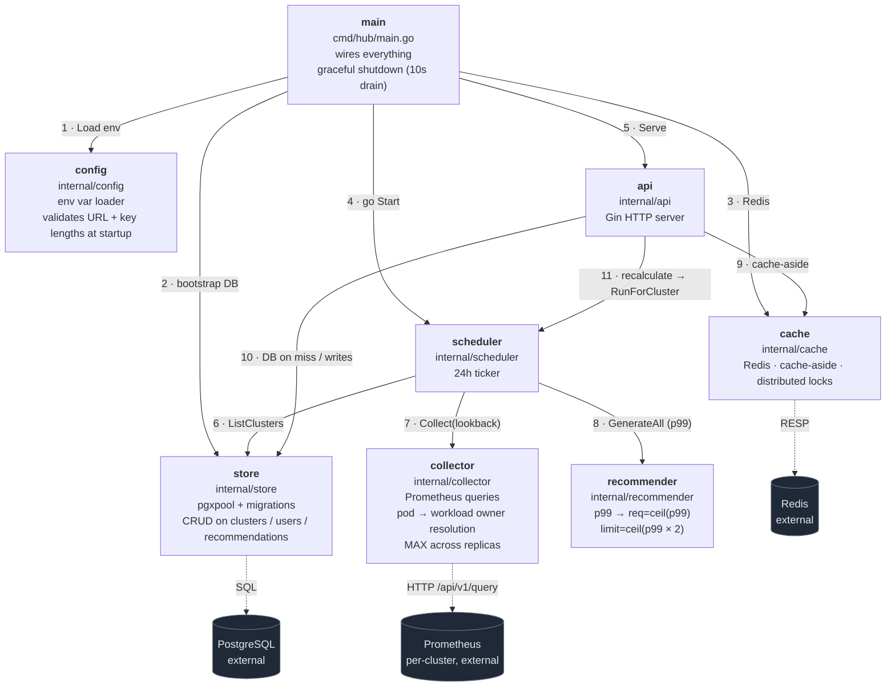

# PodOptix — Code Map

```mermaid
flowchart TB
    main["<b>main</b><br/>cmd/hub/main.go<br/>wires everything<br/>graceful shutdown (10s drain)"]

    config["<b>config</b><br/>internal/config<br/>env var loader<br/>validates URL + key lengths at startup"]
    store["<b>store</b><br/>internal/store<br/>pgxpool + migrations<br/>CRUD on clusters / users / recommendations"]
    cache["<b>cache</b><br/>internal/cache<br/>Redis · cache-aside · distributed locks"]
    collector["<b>collector</b><br/>internal/collector<br/>Prometheus queries<br/>pod → workload owner resolution<br/>MAX across replicas"]
    recommender["<b>recommender</b><br/>internal/recommender<br/>p99 → req=ceil(p99)<br/>limit=ceil(p99 × 2)"]
    scheduler["<b>scheduler</b><br/>internal/scheduler<br/>24h ticker"]
    api["<b>api</b><br/>internal/api<br/>Gin HTTP server"]

    pg[("PostgreSQL<br/>external")]
    rd[("Redis<br/>external")]
    prom[("Prometheus<br/>per-cluster, external")]

    main -->|"1 · Load env"| config
    main -->|"2 · bootstrap DB"| store
    main -->|"3 · Redis"| cache
    main -->|"4 · go Start"| scheduler
    main -->|"5 · Serve"| api

    scheduler -->|"6 · ListClusters"| store
    scheduler -->|"7 · Collect(lookback)"| collector
    scheduler -->|"8 · GenerateAll (p99)"| recommender

    api -->|"9 · cache-aside"| cache
    api -->|"10 · DB on miss / writes"| store
    api -->|"11 · recalculate → RunForCluster"| scheduler

    store -.->|SQL| pg
    cache -.->|RESP| rd
    collector -.->|HTTP /api/v1/query| prom

    classDef ext fill:#1f2937,stroke:#6b7280,color:#e5e7eb
    class pg,rd,prom ext
```
