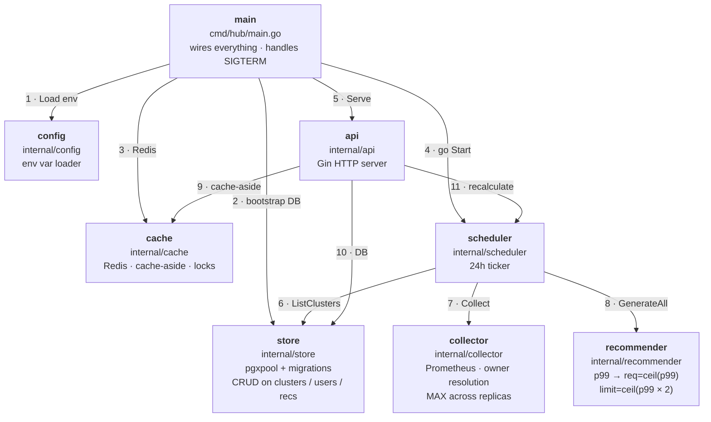

# PodOptix — Code Map

```mermaid
flowchart TB
    main["<b>main</b><br/>cmd/hub/main.go<br/>wires everything · handles SIGTERM"]

    config["<b>config</b><br/>internal/config<br/>env var loader"]
    store["<b>store</b><br/>internal/store<br/>pgxpool + migrations<br/>CRUD on clusters / users / recs"]
    cache["<b>cache</b><br/>internal/cache<br/>Redis · cache-aside · locks"]
    collector["<b>collector</b><br/>internal/collector<br/>Prometheus · owner resolution<br/>MAX across replicas"]
    recommender["<b>recommender</b><br/>internal/recommender<br/>p99 → req=ceil(p99)<br/>limit=ceil(p99 × 2)"]
    scheduler["<b>scheduler</b><br/>internal/scheduler<br/>24h ticker"]
    api["<b>api</b><br/>internal/api<br/>Gin HTTP server"]

    main -->|"1 · Load env"| config
    main -->|"2 · bootstrap DB"| store
    main -->|"3 · Redis"| cache
    main -->|"4 · go Start"| scheduler
    main -->|"5 · Serve"| api

    scheduler -->|"6 · ListClusters"| store
    scheduler -->|"7 · Collect"| collector
    scheduler -->|"8 · GenerateAll"| recommender

    api -->|"9 · cache-aside"| cache
    api -->|"10 · DB"| store
    api -->|"11 · recalculate"| scheduler
```
