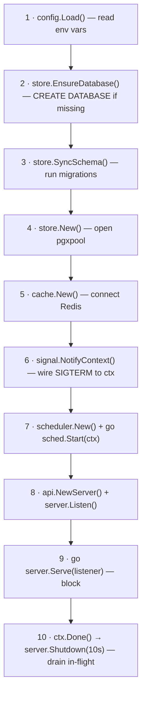
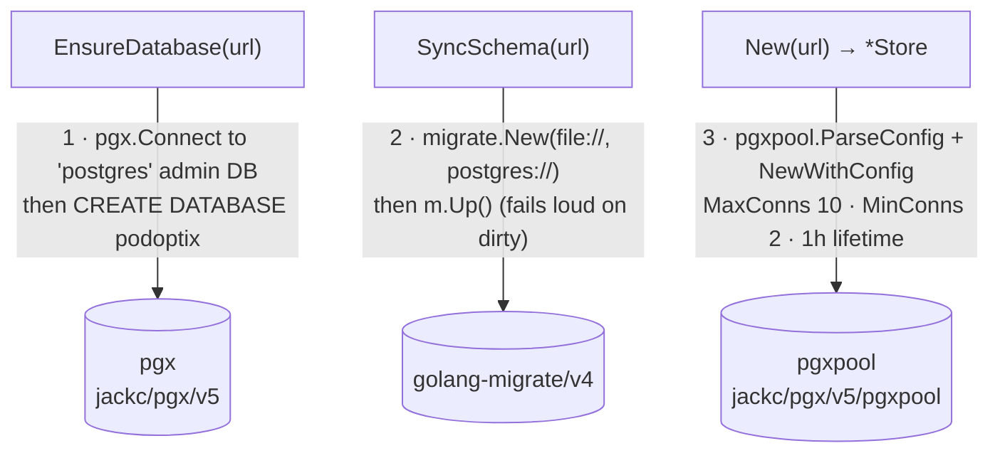
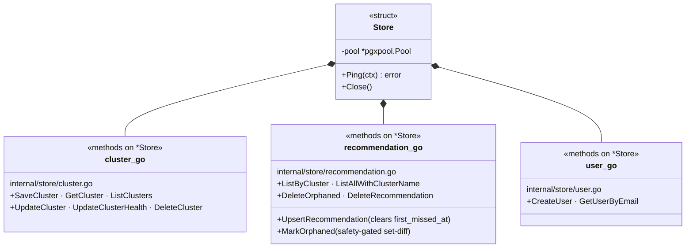
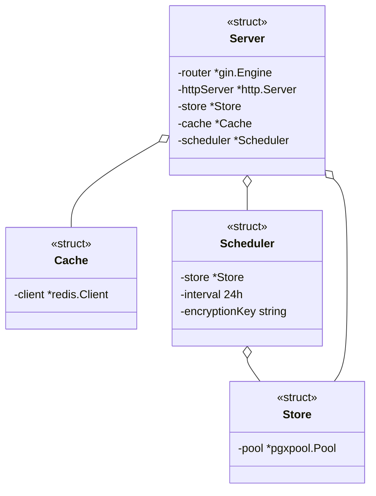
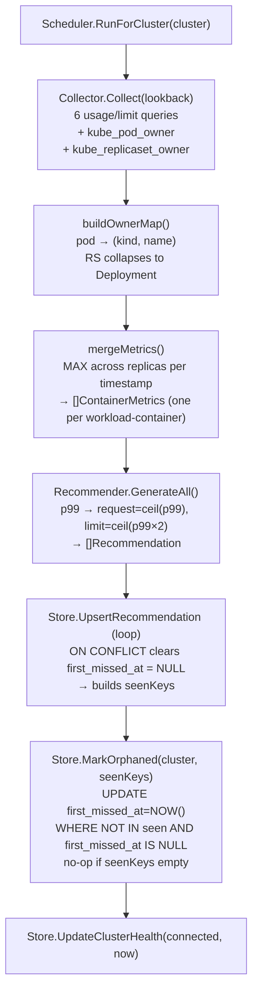
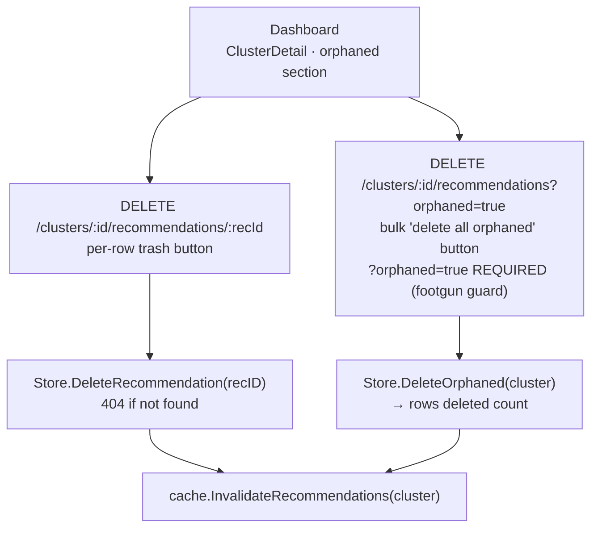

# PodOptix — Code Map

A living diagram of the codebase. Grows as we walk through each file.

Rendered natively by GitHub (Mermaid). Zero dependencies.

**House rules:**
- Each diagram tells ONE story. Many small diagrams beat one giant one.
- Arrows go top-to-bottom or left-to-right only. **No cross arrows.**
- If an arrow would cross, split the diagram instead.

---

## Legend

| Arrow | Meaning |
|-------|---------|
| `A --> B` | A calls B |
| `A ..> B` | A creates / returns B |
| `A o-- B` | A holds a pointer to B (B lives independently) |
| `A *-- B` | A owns B (B dies with A) |

---

## 1 · Startup sequence (`cmd/hub/main.go`)

What `main()` does, in order:

---

## 2 · `internal/store/store.go` — DB bootstrap

Three steps, three different libraries, strict chronological chain:

---

## 3 · `*Store` and its CRUD method files

`*Store` is just a wrapper around `*pgxpool.Pool`. The CRUD methods live in sibling files that attach to `*Store` via Go's method receiver syntax:

Three repeating patterns across all three files:
- `pool.Exec` + check err → INSERT with no match check
- `pool.Exec` + `tag.RowsAffected()==0` → UPDATE/DELETE where no-match = not-found error
- `pool.QueryRow+Scan` (one row) or `pool.Query + rows.Next + Scan` (many rows) → SELECT

---

## 4 · Who holds what at runtime

After `main()` wires everything together:

`o--` means "holds a pointer to" — the Store/Cache are created once by `main` and shared. `defer db.Close()` in `main` cleans them up at shutdown.

---

## 5 · Recommendation lifecycle (scheduler run)

End-to-end flow of one scheduler tick for one cluster:

---

## 6 · Delete / orphan review path

Operator reviews orphans in the dashboard and clicks delete:

---

## What's coming next

Each session adds a new focused diagram. Up next: `internal/config/config.go` on a second review pass.
