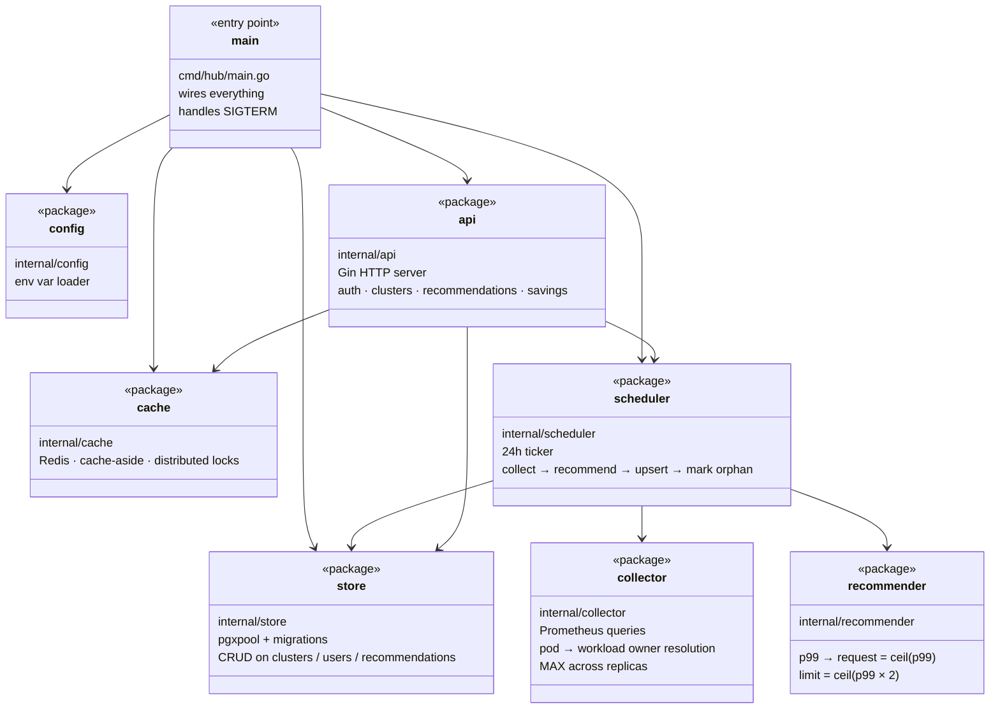

# PodOptix — Code Map

A single big-picture view of the codebase. Package dependencies only — no methods, no 3rd-party libs, no SQL. For details, read the file.

Rendered natively by GitHub (Mermaid). Zero dependencies.

---

## Legend

| Arrow | Meaning |
|-------|---------|
| `A --> B` | A depends on / calls into B |
| `A ..> B` | A creates B |

---

## The map

---

## In English

- **`main`** boots everything and listens for SIGTERM. See `cmd/hub/main.go`.
- **`config`** loads env vars. Called once at startup, never touched again.
- **`store`** is the only thing that talks to PostgreSQL. Wraps a connection pool and exposes CRUD methods. Everyone else calls into it.
- **`cache`** is the only thing that talks to Redis. Used by the API for recommendation list caching + per-cluster recalculate locks.
- **`collector`** queries Prometheus and collapses pod-level metrics into workload-level `ContainerMetrics`.
- **`recommender`** turns `ContainerMetrics` into `Recommendation` rows using the p99 formula.
- **`scheduler`** owns the 24h loop. For each cluster: collect → recommend → upsert → mark anything missing as orphaned.
- **`api`** is the HTTP layer. Reads via cache-first (cache + store), writes via store, triggers manual recalc via scheduler.

**Key design point:** only `store` talks to Postgres, only `cache` talks to Redis, only `collector` talks to Prometheus. If an external system changes, exactly one package needs to update.
