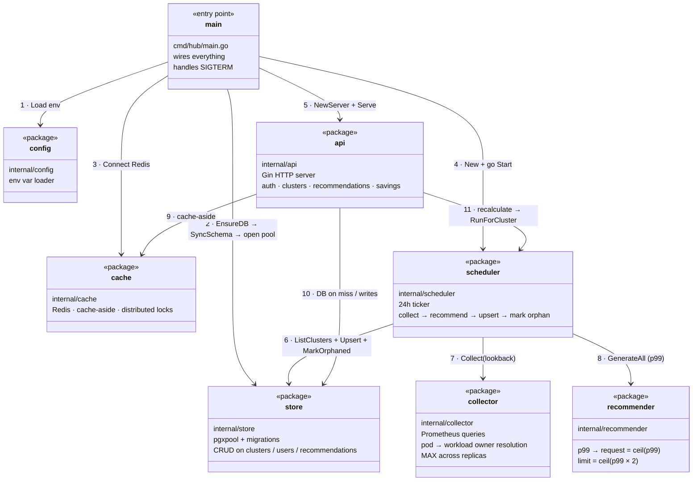

# PodOptix — Code Map

```mermaid
classDiagram
    direction TB

    class main {
        <<entry point>>
        cmd/hub/main.go
        wires everything
        handles SIGTERM
    }

    class config {
        <<package>>
        internal/config
        env var loader
    }

    class store {
        <<package>>
        internal/store
        pgxpool + migrations
        CRUD on clusters / users / recommendations
    }

    class cache {
        <<package>>
        internal/cache
        Redis · cache-aside · distributed locks
    }

    class collector {
        <<package>>
        internal/collector
        Prometheus queries
        pod → workload owner resolution
        MAX across replicas
    }

    class recommender {
        <<package>>
        internal/recommender
        p99 → request = ceil(p99)
        limit = ceil(p99 × 2)
    }

    class scheduler {
        <<package>>
        internal/scheduler
        24h ticker
        collect → recommend → upsert → mark orphan
    }

    class api {
        <<package>>
        internal/api
        Gin HTTP server
        auth · clusters · recommendations · savings
    }

    main --> config : 1 · Load env
    main --> store : 2 · EnsureDB → SyncSchema → open pool
    main --> cache : 3 · Connect Redis
    main --> scheduler : 4 · New + go Start
    main --> api : 5 · NewServer + Serve

    scheduler --> store : 6 · ListClusters + Upsert + MarkOrphaned
    scheduler --> collector : 7 · Collect(lookback)
    scheduler --> recommender : 8 · GenerateAll (p99)

    api --> cache : 9 · cache-aside
    api --> store : 10 · DB on miss / writes
    api --> scheduler : 11 · recalculate → RunForCluster
```
