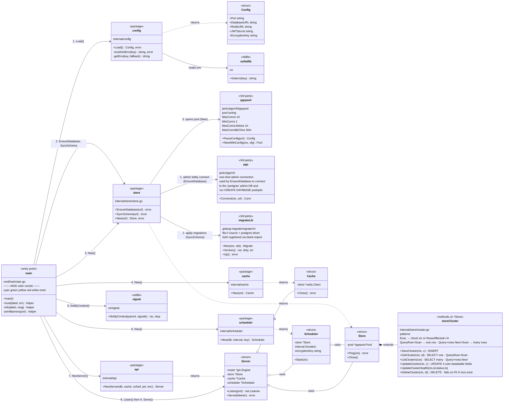

# PodOptix — Code Map

A living diagram of the codebase. Grows as we walk through each file.

Rendered natively by GitHub (Mermaid syntax). Zero dependencies.

---

## Legend

| Arrow | Meaning |
|-------|---------|
| `A --> B : foo()` | A calls `B.foo()` directly |
| `A ..> B : creates` | A instantiates B |
| `A --|> B` | A inherits/implements B |
| `A o-- B` | A holds B (aggregation — B lives independently) |
| `A *-- B` | A owns B (composition — B dies with A) |

**Stereotypes used:**

| Stereotype | What it marks |
|------------|---------------|
| `<<entry point>>` | Where the program starts (`func main`) |
| `<<package>>` | A Go package (collection of files under one `internal/x/`) |
| `<<struct>>` | A single Go struct type |
| `<<helper>>` | Internal utility function |

---

## Current scope: `cmd/hub/main.go`

So far the diagram covers the startup orchestration — the entry point and every package `main` directly calls.



### What this says in English

1. **main** is the orchestrator. It knows about 6 external packages: `config`, `store`, `cache`, `scheduler`, `api`, and stdlib `signal`.
2. **main → config.Load()** returns a `Config` struct with env vars.
3. **main → store.EnsureDatabase() + SyncSchema() + New()** — DB bootstrap, then open the pool, returns a `*Store`.
4. **main → cache.New()** — Redis connection, returns a `*Cache`.
5. **main → signal.NotifyContext()** — wires OS signals (Ctrl+C, SIGTERM) to cancel a context.
6. **main → scheduler.New()** — constructs the `*Scheduler`, which **holds** a pointer to `*Store`.
7. **main → api.NewServer()** — constructs the `*Server`, which **holds** pointers to `*Store`, `*Cache`, `*Scheduler`.
8. **main → Server.Listen() → Serve()** — bind port, run until the signal context cancels.

The `o--` (aggregation) arrows show that the Scheduler and Server don't own their dependencies — they share pointers to the Store/Cache that `main` created and will clean up via `defer`.

---

## Workload-level recommendation flow (Phases 1–4)

The scheduler, collector, recommender, and store cooperate on a loop:
*collect from Prometheus → collapse pods into workloads → compute p99 → upsert → tombstone anything missing*.

```mermaid
classDiagram
    direction TB

    class Scheduler {
        <<package>>
        internal/scheduler/scheduler.go
        +Start(ctx)
        -syncCluster(ctx, cluster)
        24h ticker + immediate on startup
    }

    class Collector {
        <<package>>
        internal/collector/prometheus.go
        +Collect(ctx, lookback) []ContainerMetrics
        6 range + instant queries
        + kube_pod_owner (new)
        + kube_replicaset_owner (new)
    }

    class ownerMap {
        <<helper>>
        buildOwnerMap()
        pod → ownerRef{kind,name}
        RS collapses to Deployment
    }

    class mergeMetrics {
        <<helper>>
        resolveWorkload()
        timeSeries.mergeMax()
        MAX across replicas per t
    }

    class ContainerMetrics {
        <<struct>>
        Namespace
        WorkloadKind / WorkloadName
        ContainerName
        ReplicaCount
        CPUValues / MemValues
        current req/limit (MAX across replicas)
    }

    class Recommender {
        <<package>>
        internal/recommender/recommender.go
        +GenerateAll(cluster, []ContainerMetrics)
        +Generate(cluster, metrics)
        formula: req=ceil(p99) · lim=ceil(p99×2)
    }

    class Recommendation {
        <<struct>>
        pkg/models/recommendation.go
        + Namespace, WorkloadKind, WorkloadName, ContainerName
        + current/p99/recommended CPU + Mem
        + Applied, OrphanedAt *time.Time
    }

    class StoreRec {
        <<package>>
        internal/store/recommendation.go
        +UpsertRecommendation(ctx, rec)
        +MarkOrphaned(ctx, cluster, seenKeys)
        +DeleteOrphaned(ctx, cluster)
        +DeleteRecommendation(ctx, recID)
        +ListByCluster · ListAllWithClusterName
    }

    class recommendations_table {
        <<db table>>
        migrations/000002
        UNIQUE (cluster, ns, kind, name, container)
        orphaned_at TIMESTAMPTZ NULL
        idx_recommendations_orphaned (partial)
    }

    class ApiRec {
        <<package>>
        internal/api/recommendation.go
        +listRecommendations (cache then DB)
        +listAllRecommendations (cross-cluster)
        +recalculate (202 + background)
        +deleteRecommendation (per row)
        +deleteOrphanedRecommendations (?orphaned=true)
    }

    Scheduler --> Collector : 1. Collect()
    Collector --> ownerMap : 2. buildOwnerMap()
    Collector --> mergeMetrics : 3. collapse replicas
    mergeMetrics ..> ContainerMetrics : one per workload-container
    Scheduler --> Recommender : 4. GenerateAll()
    Recommender ..> Recommendation : one per workload-container
    Scheduler --> StoreRec : 5. UpsertRecommendation()
    StoreRec --> recommendations_table : INSERT/UPDATE (clears orphaned_at)
    Scheduler --> StoreRec : 6. MarkOrphaned(seenKeys)
    StoreRec --> recommendations_table : UPDATE orphaned_at=NOW() WHERE NOT IN seen

    ApiRec --> StoreRec : list / delete
    ApiRec --> recommendations_table : via StoreRec
```

### What this says in English

1. **Scheduler** fires every 24h (and on startup). For each cluster it decrypts the Prometheus token and calls `Collector.Collect(lookback)`.
2. **Collector** fires 6 PromQL queries (CPU usage, mem usage, 4× req/limit) PLUS two owner queries (`kube_pod_owner`, `kube_replicaset_owner`). The owner results feed `buildOwnerMap` → `map[pod] → ownerRef`. ReplicaSets collapse to their Deployment parent.
3. **mergeMetrics** resolves each pod's time series to a `(ns, workload_kind, workload_name, container)` key and takes **MAX across replicas** at each timestamp. Request/limit scalars also take MAX across replicas. `ReplicaCount` = distinct pods observed.
4. **Recommender** computes `p99 → request=ceil(p99)`, `limit=ceil(p99×2)` on the aggregated series.
5. **Store.UpsertRecommendation** writes to `recommendations` with ON CONFLICT on `(cluster, ns, kind, name, container)`. It **clears `orphaned_at = NULL` on every upsert** — a workload we just saw is alive.
6. **Scheduler.MarkOrphaned(seenKeys)** stamps `orphaned_at=NOW()` on every row for the cluster that is NOT in `seenKeys`. Safety-gated: if `seenKeys` is empty, no-op (a hiccupped Prometheus scrape never orphans a whole cluster).
7. **Dashboard** reads `ListByCluster` and splits by `orphaned_at`. Operators review the orphaned section and delete via `DELETE /clusters/:id/recommendations/:recId` or `DELETE /clusters/:id/recommendations?orphaned=true`.

---

## What's coming next

Each session adds boxes + arrows. By the end we'll have the complete call graph: HTTP handlers → store methods → SQL, scheduler → collector → PromQL, etc.

**Next add:** `internal/store/user.go` — the auth-side CRUD on `*Store`.
