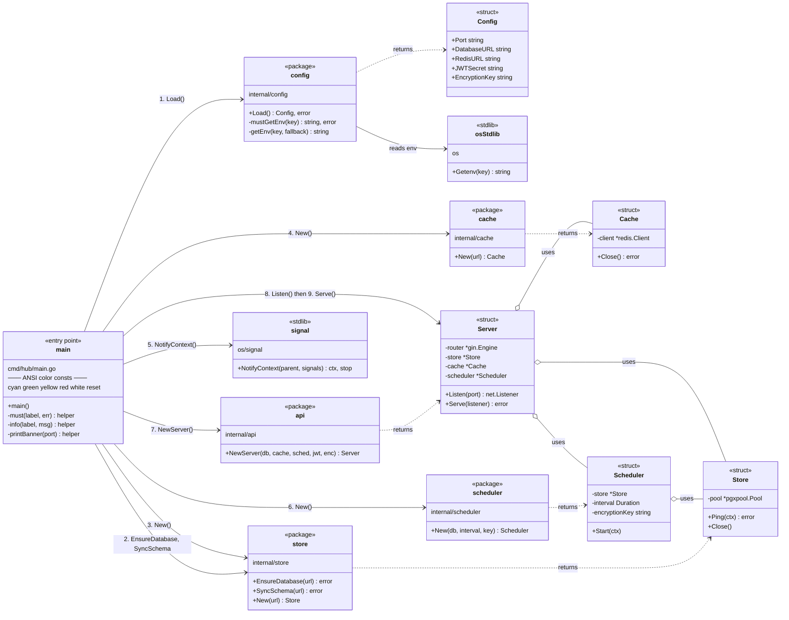

# PodOptix — Code Map

A living diagram of the codebase. Grows as we walk through each file.

Rendered natively by GitHub (Mermaid syntax). Zero dependencies.

---

## Legend

| Arrow | Meaning |
|-------|---------|
| `A --> B : foo()` | A calls `B.foo()` directly |
| `A ..> B : creates` | A instantiates B |
| `A --|> B` | A inherits/implements B |
| `A o-- B` | A holds B (aggregation — B lives independently) |
| `A *-- B` | A owns B (composition — B dies with A) |

**Stereotypes used:**

| Stereotype | What it marks |
|------------|---------------|
| `<<entry point>>` | Where the program starts (`func main`) |
| `<<package>>` | A Go package (collection of files under one `internal/x/`) |
| `<<struct>>` | A single Go struct type |
| `<<helper>>` | Internal utility function |

---

## Current scope: `cmd/hub/main.go`

So far the diagram covers the startup orchestration — the entry point and every package `main` directly calls.

### What this says in English

1. **main** is the orchestrator. It knows about 6 external packages: `config`, `store`, `cache`, `scheduler`, `api`, and stdlib `signal`.
2. **main → config.Load()** returns a `Config` struct with env vars.
3. **main → store.EnsureDatabase() + SyncSchema() + New()** — DB bootstrap, then open the pool, returns a `*Store`.
4. **main → cache.New()** — Redis connection, returns a `*Cache`.
5. **main → signal.NotifyContext()** — wires OS signals (Ctrl+C, SIGTERM) to cancel a context.
6. **main → scheduler.New()** — constructs the `*Scheduler`, which **holds** a pointer to `*Store`.
7. **main → api.NewServer()** — constructs the `*Server`, which **holds** pointers to `*Store`, `*Cache`, `*Scheduler`.
8. **main → Server.Listen() → Serve()** — bind port, run until the signal context cancels.

The `o--` (aggregation) arrows show that the Scheduler and Server don't own their dependencies — they share pointers to the Store/Cache that `main` created and will clean up via `defer`.

---

## What's coming next

Each session adds boxes + arrows. By the end we'll have the complete call graph: HTTP handlers → store methods → SQL, scheduler → collector → PromQL, etc.

**Next add:** `internal/store/store.go` (adds the `EnsureDatabase` chicken-and-egg dance, `SyncSchema` migrations, and the `pgxpool` connection pool).
